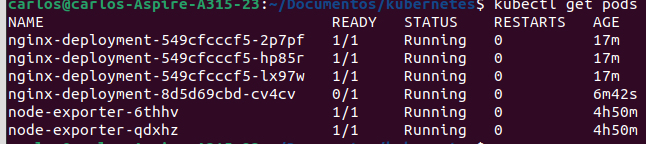
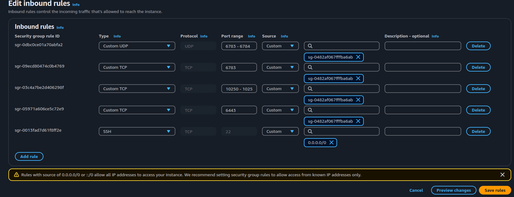
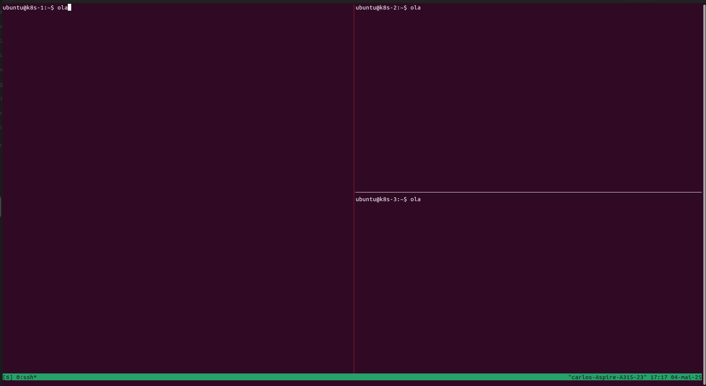
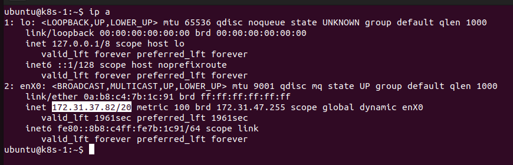
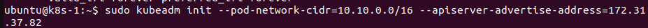
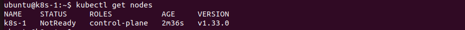
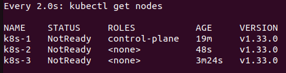
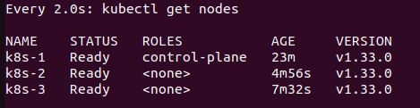

# Descomplicando o Kubernetes 

Anotações para uso pessoal baseado no curso Descomplicando o Kubernetes [Linuxtips](https://linuxtips.io/).

## Comandos básicos

Para criar um cluster chamado giropops com o kind:
```bash
kind create cluster --name giropops
```

Alguns comandos básicos para trabalhar com um cluster, nodes, namespaces:
```bash
kind get clusters
kind delete clusters $(kind get clusters)

kubectl get nodes

kubectl get namespaces
kubectl create namespace name-namespace
```

Alguns comandos básicos para trabalhar com os pods:
```bash
kubectl get pods # lista os pods do namespace default
kubectl get pod -n kube-system # lista os pods do namespace kube-system
kubectl run alpine --image alpine -it # executar no modo iterativo
kubectl get pods -A # lista todos os pods
kubectl get pods -A -o wide # informações detalhadas
```

```bash
kubectl run nginx --image nginx # cria um pod chamado nginx contendo o container criado da imagem  nginx
kubectl run alpine --image apline -it # cria e executa no modo iterativo 
kubectl run nginx-test --image=nginx --namespace=prod # cria o pod no namespace especificado
kubectl delete pod nginx --namespace=meu-namespace
```

Para criar um clustar com multiplos nodes utilize um arquivo yaml como abaixo:
```bash
cat << EOF > $HOME/kind-3nodes.yaml
kind: Cluster
apiVersion: kind.x-k8s.io/v1alpha4
nodes:
- role: control-plane
- role: worker
- role: worker
EOF
```

Execute:

```bash
kind create cluster --name kind-multinodes --config $HOME/kind-3nodes.yaml
```

Também é possível criar pods com arquivo yaml:

```bash
kubectl run meu-nginx --image nginx --port 80 --dry-run=client -o yaml > pod1-template.yaml #simula a criação de um pod e salva as especificações do pod em um arquivo yaml

kubectl apply -f pod-template.yaml #cria o pod com a partir do arquivo yaml

kubectl expose pod name-pod 

kubectl describe pods name-pod

kubectl logs name-pod

kubectl logs -f name-pod # Para ver os logs em tempo real
```

Note que para dar o expose é necessario ter definido a porta do container (nesse caso a porta de target será a mesma que a definida em containerPort).

```bash
kubectl get services

kubectl get all
kubectl get pod,service

kubectl delete -f pod-template.yaml
kubectl delete service nginx
```

Dentro de um pod os containers terao o mesmo IP. Portanto a comunicação dentro do pod é realizado pelo localhost e entre pods é pelo IP. O comando expose serve para sevir o pod fora do cluster (por padrão um pod tem acesso ao outro).

Para criar um pod com mais de um container:

```yaml
apiVersion: v1 # versão da API do Kubernetes
kind: Pod # tipo do objeto que estamos criando
metadata: # metadados do Pod
  name: giropops # nome do Pod que estamos criando
  labels: # labels do Pod
    run: giropops # label run com o valor giropops
spec: # especificação do Pod
  containers: # containers que estão dentro do Pod
  - name: girus # nome do container
    image: nginx # imagem do container
    ports: # portas que estão sendo expostas pelo container
    - containerPort: 80 # porta 80 exposta pelo container
  - name: strigus # nome do container
    image: alpine # imagem do container
    args:
    - sleep
    - "1800"
```

Name é o identificador do Pod, enquanto run (labels) é uma label usada para categorizar ou agrupar o Pod com outras entidades, facilitando a seleção e a automação de operações.

Para se conectar ao container:

```bash
kubectl attach giropops -c strigus
```

Usando o attach é como se estivéssemos conectando diretamente em uma console
de uma máquina virtual, não estamos criando nenhum processo dentro do container,
apenas nos conectando a ele. Para executar um comando

```bash
kubectl exec giropops -c strigus -- ls
```

Para se conectar ao pod e utiliza-lo de modo iterativo adicione a flag -it.

```bash
kubectl exec giropops -c strigus -it -- sh
```

## Resources e EmptyDir

É possível configurar volumes e limitar o uso de recursos por container ao definir um pod como abaixo:


```yaml
apiVersion: v1 
kind: Pod
metadata:
  name: giropops
  labels:
    run: giropops
spec:
  containers:
  - name: girus
    image: nginx 
    ports:
    - containerPort: 80 
    resources: 
      limits:
        memory: "128Mi"
        cpu: "0.5" 
      requests: 
        memory: "64Mi" 
        cpu: "0.3"
  - name: strigus
    image: ubuntu
    args:
    - sleep
    - infinity
    volumeMounts: 
    - name: primeiro-emptydir 
      mountPath: /giropops 
    resources: 
      limits:
        memory: "128Mi"
        cpu: "0.8" 
      requests: 
        memory: "64Mi" 
        cpu: "0.3"
  volumes:
    - name: primeiro-emptydir
      emptyDir:
        sizeLimit: 256Mi 
```

Requests é referente aos recursos garantidos ao container e o limits é a quantidade máxima de recurso que o container irá usar.

## Deployments

O deployment permite:

- Controlar o número desejado de Pods
de uma aplicação. Ele garante que a quantidade correta de instâncias da aplicação esteja sempre em execução.

- Atualizar aplicaçoẽs de forma fácil e segura, empregando estrategias como "rolling" (em que algumas instâncias são atualizadas de cada vez), minimizando o tempo de inatividade.

- Escalonamento: Ele permite aumentar ou diminuir o número de Pods em resposta a mudanças na carga de trabalho.

- Armazenar o histórico de diferentes versões da aplicação, permitindo voltar para versões estáveis quando necessário.

Exemplo de arquivo yaml:

```yaml
apiVersion: apps/v1
kind: Deployment
metadata:
  labels:
    app: nginx-deployment
  name: nginx-deployment
spec:
  replicas: 3
  selector:
    matchLabels:
      app: nginx-deployment
  strategy: {}
  template:
    metadata:
      labels:
        app: nginx-deployment
    spec:
      containers:
      - image: nginx
        name: nginx
        resources: 
          limits:
            cpu: 0.7
            memory: 256Mi
          requests:
            cpu: 0.3
            memory: 64Mi
```
As especificações do deployment são aplicados sobre os labels dos pods (definidos em metadata) definidos em matchLabels.


```bash
kubectl get deployments -l app=nginx-deployment
kubectl get pods -l app=nginx-deployment
kubectl describe  deployment -l app=nginx-deployment
kubectl create deployment --image nginx --replicas 3 nginx-deployment
kubectl create deployment --image nginx --replicas 3 nginx-deployment --dry-run=client -o yaml > temp.yaml

```

Caso seja necessário atualizar o deployment, como por exemplo a versao da imagem basta dar o comando apply novamente.

### Estrategias de atualização

RollingUpdate:
  - Atualiza um pod por vez ou um grupo de pods (default). Exemplo de configuração:
  
  ```yaml
  strategy:
    type: RollingUpdate
    rollingUpdate:
      maxSurge: 1
      maxUnavailable: 2
  ```
Recreate:
  - Atualiza todos de uma vez.

maxSurge: define a quantidade máxima de Pods que podem ser criados a
mais durante a atualização (pode ser definido por percentual).

maxUnavailable: define a quantidade máxima de Pods que podem ficar
indisponíveis durante a atualização, ou seja, durante o processo de
atualização.

Após dar um apply para acompanhar o processo de deployment execute:

```bash
kubectl rollout status deployment name-deployment
```
Relembre, para veririficar em detalhes sobre os pods:

```bash
kubectl get pods -o yaml
```

O kubernetes faz um versionamento dos deployments. Para verificar a lista:

```bash
kubectl rollout history deployment nginx-deployment
```

Para ver detalhes de um deployment especifico:

```bash
kubectl rollout history deployment  name-deployment --to-revision=number-version
```

Para retornar o deployment para a versão anterior:
```bash
kubectl rollout undo deployment name-deployment
```

Para uma versao especifica:

```bash
kubectl rollout undo deployment name-deployment --to-revision=number-version
```

```bash
kubectl rollout pause deployment name-deployment
kubectl rollout resume deployment name-deployment
kubectl rollout restart deployment nginx-deployment
```

Após dar o pause as mudanças feitas no deployment não serão
imediatamente aplicadas. Apenas após dar o resume.

Note que o ao utilizar o undo para voltar a versão ele mantem a
o numero de replicas de pods. 

Para mudar o numero de replicas via linha de comando:

```bash
kubectl scale deployment nginx-deployment --replicas=3
```

### DaemonSet

Podemos associar um DaemonSet como um deployment que garante a replicação de
um pod em cada nó. Alguns serviços, como um exporter de métricas, geralmente são necessários em todos os nó. Dessa forma é possível utilizar o DaemonSet que 
irá garantir a execição do pod no nó (mesmo que adicionados novos nós o DaemonSet irá adicionar automaticamente o pod no nó).

A seguir um exemplo de manifesto que configura um DaemonSet:

```yaml
apiVersion: apps/v1
kind: DaemonSet
metadata:
  name: node-exporter
spec:
  selector:
    matchLabels:
      app: node-exporter
  template:
    metadata:
      labels:
        app: node-exporter
    spec:
      hostNetwork: true
      containers:
      - name: node-exporter
        image: prom/node-exporter:latest
        ports:
        - containerPort: 9100
          hostPort: 9100
        volumeMounts:
        - name: proc
          mountPath: /host/proc
          readOnly: true
        - name: sys
          mountPath: /host/sys
          readOnly: true
      volumes:
      - name: proc
        hostPath:
          path: /proc
      - name: sys
        hostPath:
          path: /sys
```

Alguns comandos:
```yaml
kubectl get daemonset
kubectl apply -f name-daemonset-file.yml
kubectl get pods -l app=tag-daemonset
kubectl describe daemonset name-daemonset
```

### Probes

Para verificar a saude de um container no pod o Kubernetes
fornece o uso de probes:

- livenessProbe: Verifica se o contêiner está em execução.
Se a verificação falhar, o container é reinicializado.

- readinessProbe: Verificar se o seu container está pronto para receber tráfego, caso falhe o service do Kubernetes irá ignorar o endpoint do container até que ele volte a passar no teste (por exemplo se houver um LoadBalancer nenhuma requisição será redirecionada para esse endpoint). 

- startupProbe: Verifica se o contêiner foi iniciado com sucesso. Se a verificação falhar, o contêiner será reiniciado. Similar ao livenessProbe porém tem grande aplicação em situações que o container demora a ser iniciado.

No exemplo abaixo podemos visualizar um deployment com probes:

```yaml
apiVersion: apps/v1
kind: Deployment
metadata:
  labels:
    app: nginx-deployment
  name: nginx-deployment
spec:
  replicas: 4
  selector:
    matchLabels:
      app: nginx-deployment
  strategy: {}
  template:
    metadata:
      labels:
        app: nginx-deployment
    spec:
      containers:
      - image: nginx:1.19.2
        name: nginx
        resources:
          limits:
            cpu: "0.5"
            memory: 256Mi
          requests:
            cpu: 0.25
            memory: 128Mi
        livenessProbe:
          exec:
            command:
              - curl
              - -f
              - http://localhost:80/
          initialDelaySeconds: 10
          periodSeconds: 10
          timeoutSeconds: 5
          successThreshold: 1
          failureThreshold: 3
        readinessProbe:
          httpGet:
            path: /
            port: 80
          initialDelaySeconds: 10
          periodSeconds: 10
          timeoutSeconds: 5
          successThreshold: 1
          failureThreshold: 3
        startupProbe:
          tcpSocket:
            port: 80
          initialDelaySeconds: 10
          timeoutSeconds: 5
```

Note o uso de três formas de verificação das probes:

- httpGet: Envia uma solicitação HTTP/ para um endpoint.
- Exec: Executa um comando no contêiner. Retorno de código 0 indica sucesso.
- tcpSocket: Tenta abrir uma conexão TCP em uma porta específica. Sucesso se a conexão puder ser estabelecida.

Por exemplo, se um teste de readinessProbe falhar (como a estategia de atualização é RollingUpdate) a atualização
ira ficar no primeiro pod.



### Configurando um Cluster na AWS (não gerenciado)

#### Requisitos 

- Linux
- 2GB ou mais de RAM
- 2 CPUS ou mais
- Conexão de rede entre todas os nodes no cluster (pode ser via rede pública ou privada).

As seguintes portas devem estar disponiveis:

  - 6443: Porta utilizada pelo Kubernetes API Server.
  - 10250-10255: Essas portas são usadas pelo kubelet para se comunicar com o control plane do Kubernetes. A porta 10250 é usada para comunicação de leitura/gravação e a porta 10255 é usada apenas para comunicação de leitura.
  - 30000-32767: Essas portas são usadas para serviços NodePort que precisam ser acessíveis fora do cluster. O Kubernetes aloca uma porta aleatória dentro desse intervalo para cada serviço NodePort e redireciona o tráfego para o pod correspondente.
  - 2379-2380: Essas portas são usadas pelo etcd, o banco de dados de chave-valor distribuído usado pelo control plane do Kubernetes. A porta 2379 é usada para comunicação de leitura/gravação e a porta 2380 é usada apenas para comunicação de eleição.

#### Configuração do ambiente na AWS (não gerenciado)

Crie três instancias EC2 do tipo t2.medium com ubuntu 22.04. Crie uma chave ssh e configure o security group para liberar as portas necessárias conforme a imagem abaixo (para esse exemplo use as configurações padrões de storage e rede). 



Nesse exemplo não é necessário liberar  as portas 2379-2380 pois será configurado apenas
um plane control (e portanto nao será necessário a comunicação entre planes controls), também nenhum serviço será exposto usando o NodePort (portas 30000-32767).

A liberação das portas 6783 e 6784 é devido ao uso do Weave Net. O Kubernetes não lida as implementações de rede entre os nós, devido a isso é necessário o uso do Weave Net.

Acesse via ssh as três instancias. Após isso rode em cada vm:

```bash
sudo su -
hostnamectl hostname k8s-<number>
exit
bash
```

**Dica**: Use o tmux no terminal para facilitar a configuração das três VM's simultaneamente (para criar uma aba lateral ctrl + b e execute %, para criar uma aba no sentido vertical ctrl + b e execute "). Após isso sincronize os terminais com ctrl + b e : e setw synchronize-panes:



#### Preparando o ambiente

Para instalar o Kubenetes (kubeadm) antes é necessário preparar as instancias para seu uso e instalção. Execute em todas elas: 

```bash
sudo swapoff -a

cat <<EOF | sudo tee /etc/modules-load.d/k8s.conf
overlay
br_netfilter
EOF

sudo modprobe overlay
sudo modprobe br_netfilter

cat <<EOF | sudo tee /etc/sysctl.d/k8s.conf
net.bridge.bridge-nf-call-iptables  = 1
net.bridge.bridge-nf-call-ip6tables = 1
net.ipv4.ip_forward                 = 1
EOF

sudo sysctl --system
```

Adicionar os modulos em /etc/modules-load.d/k8s.conf garante que esses módulos sejam carregados no incio. Para nao precisar reiniciar o sistema foi utilizado o modprobe.

#### Instalando os pacotes do Kubernetes

Para instalar execute:

```bash
sudo apt-get update
sudo apt-get install -y apt-transport-https ca-certificates curl gpg

curl -fsSL https://pkgs.k8s.io/core:/stable:/v1.33/deb/Release.key | sudo gpg --dearmor -o /etc/apt/keyrings/kubernetes-apt-keyring.gpg

echo 'deb [signed-by=/etc/apt/keyrings/kubernetes-apt-keyring.gpg] https://pkgs.k8s.io/core:/stable:/v1.33/deb/ /' | sudo tee /etc/apt/sources.list.d/kubernetes.list

sudo apt-get update
sudo apt-get install -y kubelet kubeadm kubectl
sudo apt-mark hold kubelet kubeadm kubectl

sudo systemctl enable --now kubelet
```

Para verificar a documentação de instalação
https://kubernetes.io/docs/setup/production-environment/tools/kubeadm/install-kubeadm/. 

O comando apt-mark hold "trava" atualizaçoes nos pacotes especificados. Já o comando systemctl enable --now
habilita o serviço kubelet para que ele inicie automaticamente quando o sistema for iniciado.

#### Instalação do containerd

```bash

sudo apt-get update && sudo apt-get install -y apt-transport-https ca-certificates curl gnupg lsb-release

curl -fsSL https://download.docker.com/linux/ubuntu/gpg | sudo gpg --dearmor -o /usr/share/keyrings/docker-archive-keyring.gpg

echo "deb [arch=amd64 signed-by=/usr/share/keyrings/docker-archive-keyring.gpg] https://download.docker.com/linux/ubuntu $(lsb_release -cs) stable" | sudo tee /etc/apt/sources.list.d/docker.list > /dev/null

sudo apt-get update && sudo apt-get install -y containerd.io

sudo containerd config default | sudo tee /etc/containerd/config.toml

sudo sed -i 's/SystemdCgroup = false/SystemdCgroup = true/g' /etc/containerd/config.toml

sudo systemctl restart containerd
sudo systemctl status containerd
```

#### Configurando o Kubectl

Apenas no control plane verifique o ip da instancia com

```bash
ip a
```



Supondo que seja 172.31.37.82 execute na VM do control plane

```bash
sudo kubeadm init --pod-network-cidr=10.10.0.0/16 --apiserver-advertise-address=172.31.37.82
```



Note que após a execução desse comando será gerado um token como na forma:

```bash
kubeadm join 172.31.37.82:6443 --token fmr5ta.bwpfj6k6xw65bvl8 \
        --discovery-token-ca-cert-hash \ sha256:4fd0b50e02b1644ef7cf6f3b3e5b60c5898148fbe2dfec90fbbc9e1a4ae07672
```

Salve esse comando (ele deverá ser executado nas vms configuradas como workers nodes).
Para executar o Kubectl execute:

```bash
mkdir -p $HOME/.kube
sudo cp -i /etc/kubernetes/admin.conf $HOME/.kube/config
sudo chown $(id -u):$(id -g) $HOME/.kube/config
```

Após isso é possível utilizar o kubectl. Note que ao executar kubectl get nodes
o Control Plane aparece  como NotReady.

Essa configuração é necessária para que o kubectl possa se comunicar com o cluster. O arquivo admin.conf contém informações de acesso ao cluster, como o endereço do servidor API, o certificado de cliente e o token de autenticação.

Eu posso ter mais de um contexto dentro do arquivo admin.conf, onde cada contexto é um cluster Kubernetes. Por exemplo, eu posso ter um contexto para o cluster de produção e outro para o cluster de desenvolvimento.

Ele contém os dados de acesso ao cluster, portanto, se alguém tiver acesso a esse arquivo, ele terá acesso ao cluster. (Desde que tenha acesso ao cluster, claro).

O arquivo admin.conf é criado quando o cluster é inicializado.



#### Adicionando os workers nodes no cluster

Em cada VM o comando salvo anteriormente no modo sudo

```bash
sudo kubeadm join 172.31.37.82:6443 --token fmr5ta.bwpfj6k6xw65bvl8 \
        --discovery-token-ca-cert-hash \ sha256:4fd0b50e02b1644ef7cf6f3b3e5b60c5898148fbe2dfec90fbbc9e1a4ae07672
```
Após isso note que ao dar o comando kubectl get nodes no control plane aparece as workers nodes como Not Ready. 



Por ultimo no control plane execute

```bash
kubectl apply -f https://github.com/weaveworks/weave/releases/download/v2.8.1/weave-daemonset-k8s.yaml
```

Isso irá executar o DaemonSet do Wave Net. Após isso:



